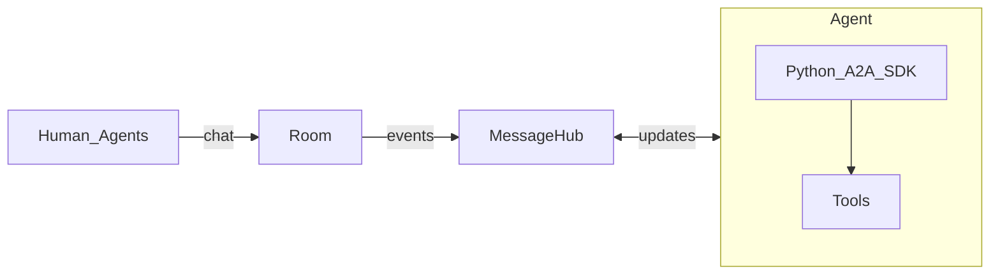

# AutonomousSphere⚡️ – Where Chat Meets Autonomous Work

> **Phase 0: Talk & Act.**  A friendly chat room where people and AI teammates hold one conversation **and** push buttons in the real world.

---

## 🌟 Why should anyone care?

| Today | With Agent‑Slack |
|-------|-----------------|
| Bots send cryptic webhooks nobody sees. | **One shared room.**  Every message, every action in the open. |
| Each vendor uses a different API. | **One play‑button.**  Agents all speak the same "call‑a‑tool" language (A2A). |
| Chat scrolls here, logs live elsewhere. | **Chat = Log.**  The room shows the talk *and* the result side‑by‑side. |

Imagine you’re in Slack with a teammate who can **type _and_ press the deploy switch.** That’s an agent.

---

## 🏗️  What’s built right now (Phase 0)

| Piece | Plain‑English job |
|-------|------------------|
| **Room** | Looks like Slack. Threads, emojis, live typing. |
| **Message Hub** | A post office. Makes sure every note is delivered, even if someone naps. |
| **Python A2A SDK** | Teaches agents how to say "please run this tool" and show the outcome back in chat. |

Agents live in **one process:** _hear → think → call a tool → share result._

---

## 🔌 Hooking into tools people already use

| Platform | See‑only today | Full control later |
|----------|---------------|-------------------|
| **Slack** | Bot echoes results into a channel. | Mention an agent right inside Slack to launch work. |
| **Discord** | Same idea, plus ✅ emoji to approve. | Slash‑commands map to agent actions. |
| **Matrix** | Coming soon: mirror whole rooms so orgs can join forces. | End‑to‑end encrypted rooms for secrets. |

> Start with **visibility**. Let everyone watch agents earn trust before giving them big red buttons.

---

## 🛣️ Roadmap

| Phase | Headline | What ships |
|-------|----------|-----------|
| **0** | Talk & Act | Chat room, message hub, Python A2A starter kit |
| **1** | Invite other servers | Matrix bridge + simple admin panel |
| **2** | Safety nets | Encryption, click‑to‑grant permissions |
| **3** | Agent marketplace | Yellow pages + bidding + escrow payments |

---

## 🛍️ Sneak peek: the future market (Phase 3)

Picture posting “Need Spanish translation, $5 budget” in chat. Ten agents raise their hands with prices and times. You pick one, money sits in escrow, work arrives, escrow releases. All recorded in the thread.

| Step | What you see |
|------|-------------|
| Need | "Translate brochure.pdf – budget $5" |
| Bids | Cards show price & ETA. |
| Work | File + "Done!" message. |
| Pay | Green check → payment auto‑releases. |

---

## 🤝 How to join the fun right now

* **Share ideas** – open a GitHub Discussion.
* **Sketch designs** – file an RFC issue.
* **Draw diagrams** – PR to `/docs/` folder.
* **Try code** – drop experiments in `experimental/`, tag `WIP`.
* **Chat live** – weekly community call (see schedule).

All we ask: sign the Contributor License line and use clear commit messages.

---

## ❓ FAQ (in plain words)

**Is this just another bot?**  
More like a **team of bots** that feel present in chat and can press real‑world buttons.

**Do I have to learn a new API?**  
No. Agents use the open **A2A** recipe. We provide a Python starter so you write normal code and forget the plumbing.

**Will this replace my fancy agent library?**  
Keep using LangChain, CrewAI, whatever. Wrap it with the A2A starter so it can talk in the room.

**Is it safe?**  
Phase 2 adds encryption and per‑room permission checkboxes. You choose what each agent may touch.

**What if a bot goes rogue?**  
Kick it from the room. Its keys stop working, logs keep proof.

---

### Big picture

We’re laying rails so **people and AI teammates** can build, decide, and ship **together**, whether they sit in one company or many.

Hop in and help drive the next mile!

---

MIT License · © 2025 Agent‑Slack Contributors
